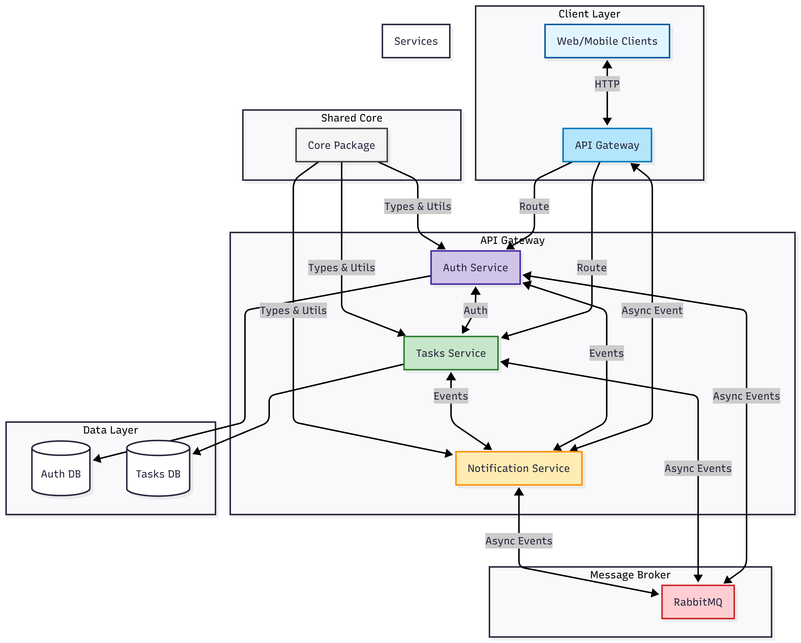
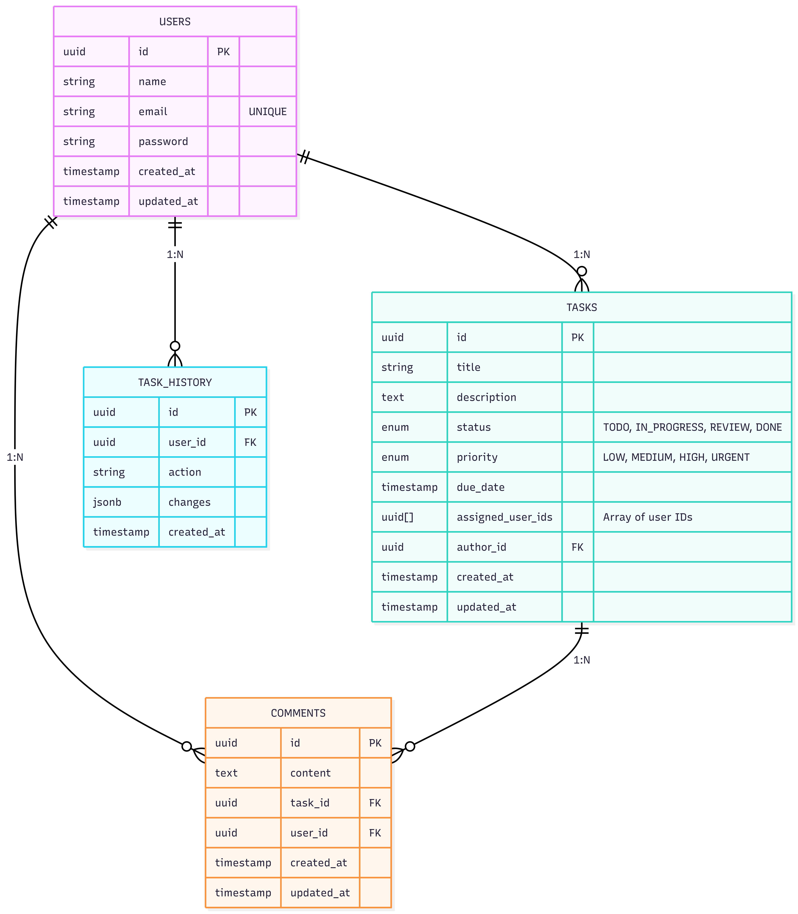

## 📋 Visão Geral

Plataforma colaborativa para gerenciamento de tarefas em tempo real, desenvolvida com arquitetura de microsserviços.

## 🏗️ Diagramas e areuitetura

    

    

## ⚠️ Problemas Conhecidos e Melhorias

### Problemas Conhecidos
1. **Notificação**: Qaundo há uma notificação sobre a atualização de uma task, sempre pega a versão ja atualizada, a que poder ser um problema se o título ser atualizado.
2. **Error Handling**: Apesar de ter criado erros customizados, a api-gateway sempre retorna status code 500 e erro genérico.

### Melhorias Futuras
- [ ] Adicionar testes nos serviçoes
- [ ] Melhorar tratamento de erros
- [ ] Adicionar documentação Swagger
- [ ] Adicionar rate limiting

## ⏱️ Tempo Gasto

| Tarefa  | Tempo Gasto 
|--------------|-------------------------------|
| Criação do core (use-cases, interfaces) | ~6h  |
| Configuração turborepo | 2 dias (~9h/dia)  |
| Configuração do typeorm(migrations, etc...) | 3 dias (~9h/dia) |
| Auth Service(controllers) | 1 dia (~7h) |
| Task Service | 2 dia (~7h/dia) |
| Notification Service | 1 dias (~9h) |
| API Gateway | 1 dia (~7h) |
| Configuração do RabbitMQ  | 3 dias (~9h/dia) |
| Notidication Service | 1 dia (~9h/dia)

## Observação
Infelizmente não consegui realizar todo o desafio dentro do tempo estipulado ficou faltando o frontend.